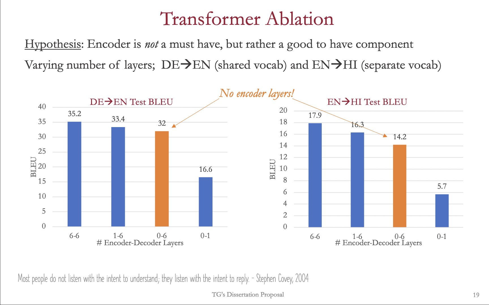

#  Transformer NMT ablation

TL;DR Transformer NMT can function without Encoder layers, and can generate decent quality outputs.
These experiments and analyses were conducted to support an argument made in my dissertation.

| Number of Layers |         | DE-EN BLEU |      | EN-HI BLEU |      | DE-EN MacroF1 |      | EN-HI MacroF1 |      |
|------------------|---------|------------|------|------------|------|---------------|------|---------------|------|
| Encoder          | Decoder | Dev        | Test | Dev        | Test | Dev           | Test | Dev           | Test |
| 6                | 6       | 39.9       | 35.2 | 15.8       | 17.9 | 45.5          | 41.4 | 27.7          | 23.7 |
| 0                | 6       | 36.8       | 32   | 13.5       | 14.2 | 42.1          | 37.9 | 24.5          | 19.6 |
| 6                | 1       | 37         | 32.7 | 14.9       | 15.7 | 42.8          | 39.2 | 25.6          | 20.9 |
| 1                | 6       | 37.8       | 33.4 | 15.2       | 16.3 | 43.2          | 39.9 | 26.1          | 22.1 |
| 1                | 1       | 32.9       | 29   | 11         | 12   | 38            | 35.2 | 20.8          | 16.6 |
| 0                | 1       | 19.7       | 16.6 | 4.9        | 5.7  | 27            | 24.1 | 12.8          | 9.1  |
| 0                | 3       | 34.5       | 30.3 | 12.7       | 12.6 | 39.9          | 35.7 | 22.4          | 18.1 |
| 1                | 3       | 36.8       | 32.4 | 14.4       | 15.8 | 42.5          | 38.9 | 25.5          | 21.3 |
| 3                | 1       | 35.9       | 31.5 | 14.4       | 14.8 | 41.2          | 38.3 | 24.4          | 19.2 |
| 0                | 12      |            |      | 13.2       | 14.2 |               |      | 24            | 19.7 |

# Chart

# Examples 

|         SRC          | SRC  | Die neue Untersuchung ist im " International Journal of Public Health " veröffentlicht . |
|----------------------|------|------------------------------------------------------------------------------------------|
| REF                  | REF  | The new study is published in the "International Journal of Public Health".              |
| 00-tfm-6_6-32k-run1  | 6-6  | The new study is published in the International Journal of Public Health.                |
| 01-tfm-6_1-32k-run1  | 6-1  | The new investigation is published in the International Journal of Public Health.        |
| 02-tfm-0_6-32k-run1  | 0-6  | The new investigation is published in the International Journal of Public Health.        |
| 03-tfm-1_6-32k-run1  | 1-6  | The new study is published in the International Journal of Public Health.                |
| 04-tfm-0_1-32k-run1  | 0-1  | The new study is published in the International Public Health Journal.                   |
| 05-tfm-1_1-32k-run1  | 1-1  | The new study is published in the International Journal of Public Health.                |
| 06-tfm-0_3-32k-run1  | 0-3  | The new investigation is published in the International Journal of Public Health.        |
| 07-tfm-3_1-32k-run1  | 3-1  | The new investigation is published in the International Journal of Public Health.        |
| 08-tfm-1_3-32k-run1  | 1-3  | The new investigation is published in the International Journal of Public Health.        |
| 09-tfm-0_12-32k-run1 | 0-12 | The new research is published in the International Journal of Public Health              |

|          SRC          | SRC | That order was of a similar nature |
|-----------------------|-----|------------------------------------|
| REF                   | REF | वह आदेश भी कुछ ऐसा ही था।          |
| 00-tfm-6_6-8k8k-run1  | 6-6 | वह आदेश भी इसी प्रकार का था ।      |
| 01-tfm-6_1-8k8k-run1  | 6-1 | वह व्यवस्था इसी प्रकार की थी ।     |
| 02-tfm-0_6-8k8k-run1  | 0-6 | यही प्रकृति का आदेश था ।           |
| 03-tfm-1_6-8k8k-run1  | 1-6 | वह आदेश समान प्रकार का था ।        |
| 04-tfm-0_1-8k8k-run1  | 0-1 | कि प्रकृति का एक समान था ।         |
| 05-tfm-1_1-8k8k-run1  | 1-1 | यह आदेश एक समान प्रकृति का था ।    |
| 06-tfm-0_3-8k8k-run1  |     | ऐसा ही प्रकृति का आदेश था ।        |
| 07-tfm-3_1-8k8k-run1  |     | यह व्यवस्था समान प्रकृति का था ।   |
| 08-tfm-1_3-8k8k-run1  |     | वह आदेश इसी प्रकार का था ।         |
| 09-tfm-0_12-8k8k-run1 |     | यह व्यवस्था भी ऐसी ही थी ।         |

|          SRC          | SRC  |       Manju Lakshmi won first prize and Shilpa won second prize.        |
|-----------------------|------|-------------------------------------------------------------------------|
| REF                   | REF  | मंजू लक्ष्मी प्रथम व शिल्पा ने द्बितीय स्थान प्राप्त किया।              |
| 00-tfm-6_6-8k8k-run1  | 6-6  | मंजु लक्ष्मी को प्रथम पुरस्कार मिला और शिल्पा को द्वितीय पुरस्कार मिला। |
| 01-tfm-6_1-8k8k-run1  | 6-1  | मंजु लक्ष्मी ने प्रथम पुरस्कार जीते और शिल्पा द्वितीय पुरस्कार जीते ।   |
| 02-tfm-0_6-8k8k-run1  | 0-6  | मंजु लक्ष्मी प्रथम पुरस्कार और शिल्पा को द्वितीय पुरस्कार मिला ।        |
| 03-tfm-1_6-8k8k-run1  | 1-6  | मंजु लक्ष्मी ने प्रथम पुरस्कार जीता और शिल्प ने दूसरा पुरस्कार जीता ।   |
| 04-tfm-0_1-8k8k-run1  | 0-1  | लक्ष्मी ने प्रथम पुरस्कार जीते और द्वितीय पुरस्कार जीते ।               |
| 05-tfm-1_1-8k8k-run1  | 1-1  | मंजु लक्ष्मी ने पहले पुरस्कार जीते और शिल।                              |
| 06-tfm-0_3-8k8k-run1  | 0-3  | मन्जु लक्ष्मी ने पहले पुरस्कार जीता और शिल्पा ने दूसरा पुरस्कार जीता ।  |
| 07-tfm-3_1-8k8k-run1  | 3-1  | मंजु लक्ष्मी प्रथम पुरस्कार जीता और शिल्पा द्वितीय पुरस्कार जीता ।      |
| 08-tfm-1_3-8k8k-run1  | 1-3  | मंजू लक्ष्मी ने प्रथम पुरस्कार जीता और शिप्पा द्वितीय पुरस्कार जीता ।   |
| 09-tfm-0_12-8k8k-run1 | 0-12 | मंजु लक्ष्मी ने प्रथम पुरस्कार जीता और द्वितीय पुरस्कार जीता ।          |

